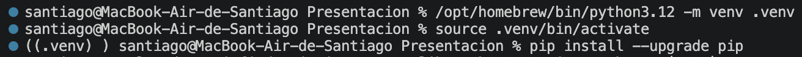
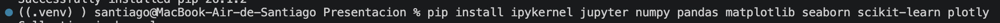
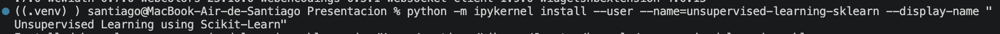
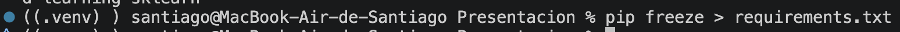
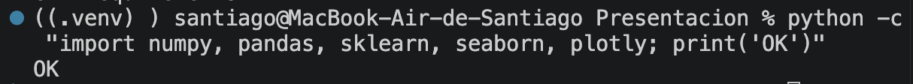

# El Ambiente de Trabajo — explicación paso a paso

Antes de entrar al tema central (**Aprendizaje No Supervisado con Scikit-Learn**), preparamos un
**entorno virtual aislado** con todas las librerías necesarias. La idea es que el proyecto tenga sus
propias dependencias, sin mezclarse con las del sistema, y que sea **reproducible**: cualquier
persona puede recrear exactamente el mismo ambiente.

Este documento explica **brevemente qué hace cada comando**, con capturas del proceso real (hecho en
**macOS**, terminal zsh, Python 3.12 de Homebrew).

> ¿Solo quieres **clonar y reproducir** el proyecto (en Mac o Windows)? Las instrucciones paso a
> paso están en el **[README](../README.md)** de la raíz del repositorio.

---

## Fase 1 — Crear y activar el entorno virtual

```bash
cd "/Users/santiago/Documents/Licenciatura en Ciencia de Datos/4_Cuarto_Semestre/Desarrollo de Aplicaciones para Análisis de Datos/Presentacion"
/opt/homebrew/bin/python3.12 -m venv .venv
source .venv/bin/activate
pip install --upgrade pip
```

| Comando | ¿Qué hace? |
| --- | --- |
| `cd "…/Presentacion"` | Nos posiciona dentro de la carpeta del proyecto, para que todo lo que creemos quede ahí. |
| `/opt/homebrew/bin/python3.12 -m venv .venv` | Usa la **ruta completa** del Python 3.12 de Homebrew para crear un entorno virtual llamado `.venv`. Indicar la ruta completa nos asegura usar la versión correcta de Python. |
| `source .venv/bin/activate` | **Activa** el entorno. A partir de aquí `python` y `pip` apuntan al entorno aislado, no al del sistema. Por eso el prompt cambia y aparece el prefijo `(.venv)`. |
| `pip install --upgrade pip` | Actualiza `pip` (el gestor de paquetes) a su última versión dentro del entorno, para evitar problemas al instalar librerías. |



---

## Fase 2 — Instalar las librerías

```bash
pip install ipykernel jupyter numpy pandas matplotlib seaborn scikit-learn plotly
```

Con un solo comando instalamos todo el stack de ciencia de datos que usaremos:

| Librería | ¿Para qué sirve? |
| --- | --- |
| **numpy** | Cálculo numérico y manejo de arreglos (la base de casi todo lo demás). |
| **pandas** | Manipulación de datos en tablas (`DataFrames`): leer, filtrar, transformar. |
| **matplotlib** | Librería base para crear gráficas. |
| **seaborn** | Visualización estadística construida sobre matplotlib (gráficas más vistosas con menos código). |
| **scikit-learn** | Algoritmos de machine learning, incluido el **aprendizaje no supervisado** (K-Means, PCA, etc.) — el corazón de la presentación. |
| **plotly** | Gráficas **interactivas** (se pueden hacer zoom, rotar, pasar el cursor). |
| **jupyter** | Entorno de *notebooks* donde escribimos y ejecutamos el código por celdas. |
| **ipykernel** | El "motor" de Python que Jupyter necesita para ejecutar el código del notebook. |



---

## Fase 3 — Registrar el kernel en Jupyter

```bash
python -m ipykernel install --user --name=unsupervised-learning-sklearn --display-name "Unsupervised Learning using Scikit-Learn"
```

Esto **registra nuestro entorno virtual como un *kernel*** de Jupyter, para poder seleccionarlo al
abrir el notebook (en Jupyter o en VS Code) y que el código se ejecute con las librerías que acabamos
de instalar.

| Parte del comando | ¿Qué hace? |
| --- | --- |
| `--user` | Lo instala solo para el usuario actual (no requiere permisos de administrador). |
| `--name=unsupervised-learning-sklearn` | Nombre **interno** del kernel (identificador). |
| `--display-name "Unsupervised Learning using Scikit-Learn"` | Nombre **visible** que aparece en la lista de kernels de Jupyter. |



---

## Fase 4 — Congelar las dependencias (reproducibilidad)

```bash
pip freeze > requirements.txt
```

`pip freeze` lista todas las librerías instaladas **con su versión exacta**, y el `>` guarda esa
lista en el archivo `requirements.txt`. Gracias a este archivo, cualquier persona puede recrear el
mismo ambiente con `pip install -r requirements.txt` (ver el [README](../README.md)).



---

## Fase 5 — Verificar que todo funciona

```bash
python -c "import numpy, pandas, sklearn, seaborn, plotly; print('OK')"
```

Esta es una **prueba rápida** (*smoke test*): intenta importar las librerías clave y, si todas cargan
sin error, imprime `OK`. Ver `OK` en la terminal confirma que el entorno quedó listo para trabajar.



---

## Resumen

1. **Creamos** un entorno virtual aislado con Python 3.12.
2. **Instalamos** las librerías de ciencia de datos.
3. **Registramos** el kernel para usarlo en Jupyter.
4. **Congelamos** las versiones en `requirements.txt` para que sea reproducible.
5. **Verificamos** que todo importa correctamente.

Con el ambiente listo y comprobado, pasamos al tema central: **Aprendizaje No Supervisado con
Scikit-Learn**.
