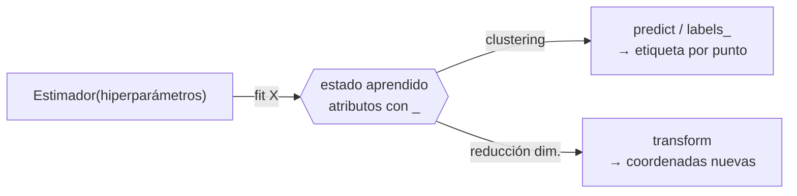
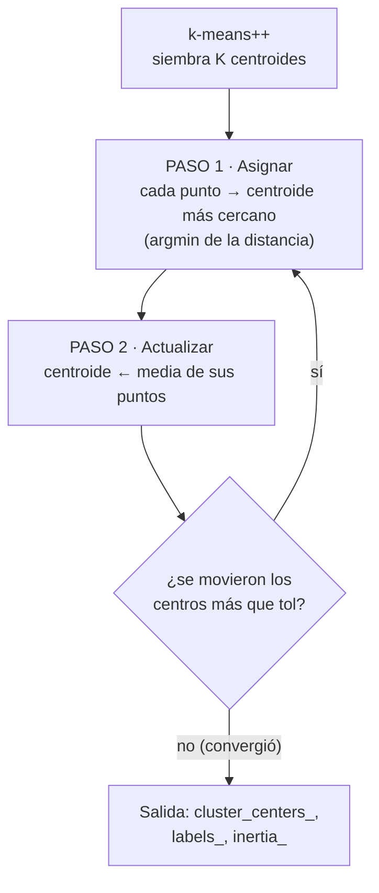
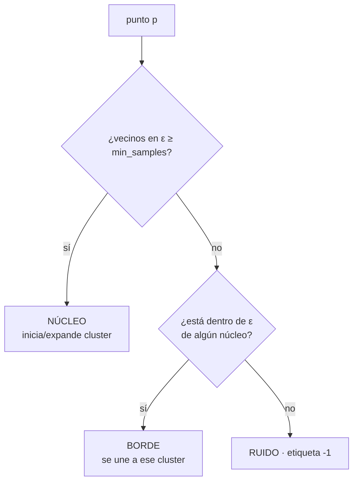
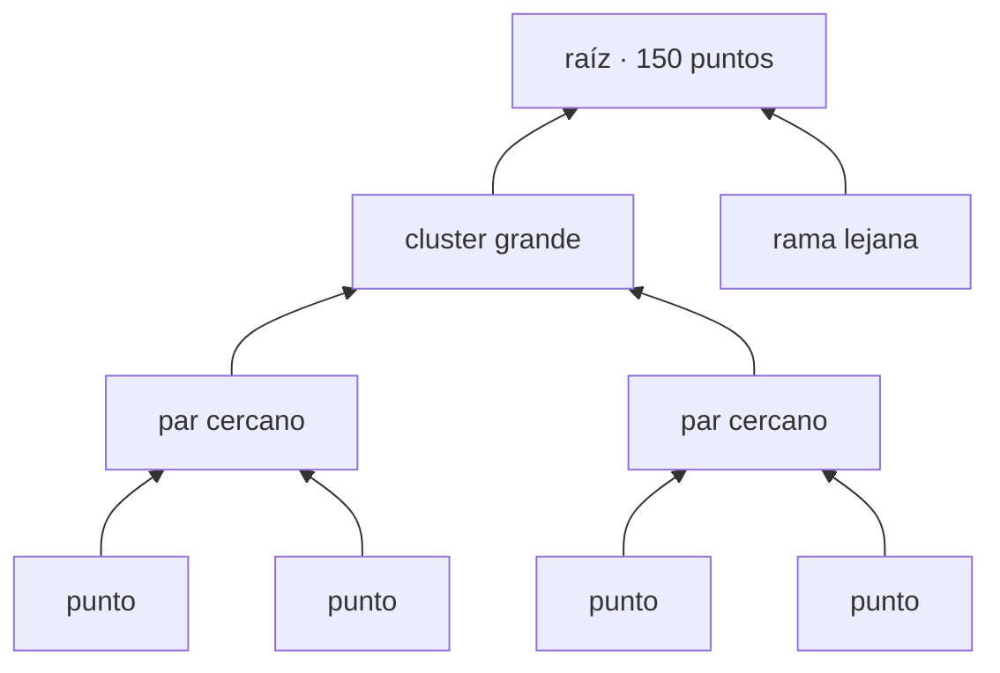
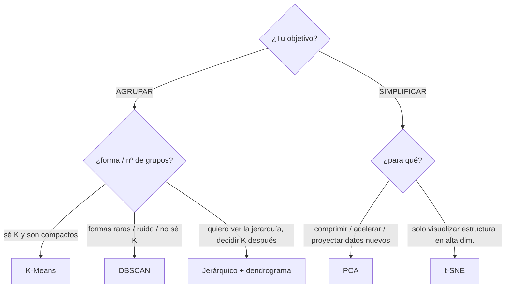

# Documentación técnica línea por línea — Aprendizaje No Supervisado con Scikit-Learn

> **Qué es esto.** El manual *introspectivo* del notebook `presentacion-aprendizaje-no-supervisado.ipynb`.
> Para cada bloque de código relevante documenta: **(1)** qué función/clase es y de qué módulo viene,
> **(2)** sus parámetros (usados y defaults que importan, con tipo y efecto), **(3)** qué hace por dentro
> el algoritmo paso a paso, **(4)** el fundamento matemático (función objetivo, distancia, optimización),
> **(5)** qué devuelve (estructura, dimensiones, significado de cada componente) y **(6)** por qué eso es
> *graficable* y qué representa la gráfica.
>
> **No documenta** el código de *plotting* en sí (configuración de `matplotlib`/`seaborn`, ejes, colores,
> `plt.show()`): solo se menciona **qué dato graficable** entra y qué representa.
>
> **Marcadores:** uso ⚠️ exclusivamente para *caveats* y comportamientos no obvios (igual que el notebook).
> Las referencias `Celda N` apuntan a la celda del notebook original para trazabilidad 1-a-1.

---

## Índice

- [0. Preliminares](#0-preliminares)
  - [0.1 Stack y versiones (los defaults dependen de esto)](#01-stack-y-versiones-los-defaults-dependen-de-esto)
  - [0.2 La anatomía de un estimador de scikit-learn](#02-la-anatomía-de-un-estimador-de-scikit-learn)
  - [0.3 Notación matemática](#03-notación-matemática)
- [A. Carga y preparación de datos](#a-carga-y-preparación-de-datos)
- [B. K-Means](#b-k-means-clustering-por-centroides)
- [C. DBSCAN](#c-dbscan-clustering-por-densidad)
- [D. Clustering jerárquico aglomerativo + dendrograma](#d-clustering-jerárquico-aglomerativo--dendrograma)
- [E. PCA](#e-pca-análisis-de-componentes-principales)
- [F. t-SNE](#f-t-sne-embedding-no-lineal-para-visualizar)
- [G. Síntesis técnica](#g-síntesis-técnica)
  - [G.1 Tabla maestra de atributos aprendidos `_`](#g1-tabla-maestra-de-atributos-aprendidos-_)
  - [G.2 Complejidad computacional](#g2-complejidad-computacional)

---

## 0. Preliminares

### 0.1 Stack y versiones (los defaults dependen de esto)

Documentar "los defaults" sin fijar la versión es un error: varios cambiaron hace poco. Todo lo que sigue
está verificado contra **el entorno real de este proyecto**:

| Librería | Versión | Defaults que cambiaron y nos afectan |
|---|---|---|
| scikit-learn | **1.9.0** | `KMeans(n_init='auto')` (antes `10`); `PCA(svd_solver='auto')` ahora puede elegir `covariance_eigh`; `TSNE(init='pca')` y `learning_rate='auto'` (antes `'random'` y `200`); `TSNE.max_iter` (renombrado desde `n_iter`). |
| scipy | 1.17.1 | `linkage` / `dendrogram` (módulo `scipy.cluster.hierarchy`). |
| numpy | 2.4.6 | — |
| pandas | 3.0.3 | `crosstab`, `value_counts`. |
| matplotlib | 3.10.9 | *(solo visualización — no se documenta)* |
| seaborn | 0.13.2 | `load_dataset`, `scatterplot` *(viz)*. |

> ⚠️ **Caveat transversal de reproducibilidad.** Muchos de estos algoritmos tienen aleatoriedad interna
> (inicialización de centroides, descenso por gradiente). Por eso casi siempre verás `random_state=42`:
> **fija la semilla del generador pseudoaleatorio** para que el resultado sea idéntico en cada corrida.
> No cambia la *calidad*, solo la *repetibilidad*.

### 0.2 La anatomía de un estimador de scikit-learn

`Celda 13.` Los 5 algoritmos del notebook comparten el mismo contrato de API. Entenderlo una vez = entenderlos todos.

```python
modelo = Estimador(hiperparámetros)   # 1. CONFIGURAR  (no toca los datos todavía)
modelo.fit(X)                          # 2. APRENDER    (corre el algoritmo sobre X)
modelo.predict(X)  /  modelo.labels_   # 3. ASIGNAR     (clustering: a qué grupo va cada punto)
modelo.transform(X)                    # 4. PROYECTAR   (reducción de dimensión: nuevas coordenadas)
```

**La regla del guion bajo.** Los atributos que terminan en `_` (`cluster_centers_`, `inertia_`, `labels_`,
`components_`, `explained_variance_ratio_`, …) son **lo que el modelo aprendió durante `fit`**, no lo que tú
configuraste. Si accedes a uno *antes* de `fit`, scikit-learn lanza `NotFittedError`. Esa convención es un
estándar (PEP-8 interno de sklearn) para distinguir *hiperparámetros de entrada* de *estado aprendido*.



Tres familias dentro del notebook, según qué pasos del contrato implementan:

| Familia | `fit` | `predict` | `labels_` | `transform` | Estimadores |
|---|:--:|:--:|:--:|:--:|---|
| Clustering particional | ✓ | ✓ | ✓ | — | `KMeans` |
| Clustering transductivo | ✓ | — | ✓ | — | `DBSCAN`, `AgglomerativeClustering` |
| Reducción lineal | ✓ | — | — | ✓ | `PCA` |
| Reducción no lineal | ✓ (`fit_transform`) | — | — | — | `TSNE` |

> ⚠️ "Transductivo" = solo etiqueta los puntos que vio en `fit`; **no hay `predict` para datos nuevos**.
> Es una propiedad del *algoritmo*, no una carencia de la librería (lo explicamos en DBSCAN y t-SNE).

### 0.3 Notación matemática

- $X \in \mathbb{R}^{n \times d}$: matriz de datos, $n$ muestras (filas) × $d$ features (columnas). En Iris $n=150,\ d=4$.
- $x_i \in \mathbb{R}^{d}$: la $i$-ésima muestra (una fila).
- $\lVert u - v \rVert = \sqrt{\sum_{m=1}^{d}(u_m - v_m)^2}$: **distancia euclídea** (norma $L_2$). Es la métrica por defecto en *todos* estos métodos.
- $\lVert u - v \rVert^2$: distancia euclídea **al cuadrado** (sin la raíz). Aparece en casi todas las funciones objetivo porque es derivable y separable.
- $C_k$: el conjunto de puntos del cluster $k$; $\lvert C_k \rvert$ su cardinalidad; $\mu_k$ su centroide (media).

---

## A. Carga y preparación de datos

### A.1 — `Celda 4`: importar datos con fallback offline

```python
import numpy as np
import pandas as pd
import matplotlib.pyplot as plt   # viz — no se documenta
import seaborn as sns             # viz — no se documenta
try:
    iris_df = sns.load_dataset('iris')                 # descarga de internet
except Exception:
    from sklearn.datasets import load_iris             # plan B sin internet
    _b = load_iris(as_frame=True)
    iris_df = _b.frame.rename(columns={...})
    iris_df['species'] = _b.target_names[_b.target.to_numpy()]
    iris_df = iris_df.drop(columns='target')
```

**`load_iris`** — módulo `sklearn.datasets`. Carga el dataset Iris que viene **empacado dentro de scikit-learn**
(archivo CSV local en el paquete), por eso funciona sin red.

| Parámetro | Valor usado | Tipo | Qué hace |
|---|---|---|---|
| `as_frame` | `True` | bool | Si `True`, devuelve los datos como `pandas.DataFrame` en `.frame` (y `.data`/`.target` como `Series`). Si `False` (default), devuelve arrays NumPy crudos. Lo ponemos en `True` para tener nombres de columna. |
| `return_X_y` | `False` (default) | bool | Si `True`, devuelve la tupla `(X, y)` en vez del objeto `Bunch`. Aquí no se usa porque queremos los metadatos. |

**Qué devuelve.** Un `Bunch` (un `dict` con acceso por atributo). Campos relevantes:
- `.data` → `(150, 4)` las 4 medidas.
- `.target` → `(150,)` enteros en `{0,1,2}` (la especie codificada).
- `.target_names` → `array(['setosa','versicolor','virginica'])`, el mapeo entero→nombre.
- `.frame` → el `DataFrame` `(150, 5)` (4 medidas + `target`).

La línea clave de reconstrucción:
```python
iris_df['species'] = _b.target_names[_b.target.to_numpy()]
```
Es **indexación vectorizada de NumPy (fancy indexing)**: `target` es un array de enteros `[0,0,...,2]`; usarlo
como índice de `target_names` produce, de un golpe, el array de *strings* `['setosa',...,'virginica']`. Convierte
la codificación numérica de vuelta a etiquetas legibles.

> ⚠️ El `try/except` no es decorativo: `sns.load_dataset('iris')` hace una **petición HTTP** al repositorio de
> seaborn. En un aula sin internet eso lanza excepción; el `except` cae al dataset local de sklearn con **los
> mismos 150 registros**, renombrando columnas para que el resto del notebook no note la diferencia.

### A.2 — `Celda 5`: verificar forma y balance

```python
print('Forma:', iris_df.shape)     # (150, 5)
iris_df['species'].value_counts()  # 50 de cada especie
```
- **`DataFrame.shape`** (pandas) → tupla `(filas, columnas)` = `(150, 5)`.
- **`Series.value_counts()`** (pandas) → cuenta ocurrencias de cada valor único y las devuelve **ordenadas de mayor a menor** como una `Series` (índice = valor, dato = conteo). Resultado: `setosa 50, versicolor 50, virginica 50`. Confirma que el dataset está **perfectamente balanceado** (importante: un dataset desbalanceado sesgaría visualmente la lectura de los clusters).

### A.3 — `Celda 10`: construir la matriz `X`

```python
numeric_cols = ['sepal_length', 'sepal_width', 'petal_length', 'petal_width']
X = iris_df[numeric_cols]
```
**Indexación de columnas de pandas** (`df[lista]`) → devuelve un `DataFrame` `(150, 4)` con **solo las 4 features
numéricas**, sin `species`. Esta es la matriz $X$ que reciben *todos* los algoritmos. El orden de las columnas
importa y lo reusaremos: `0=sepal_length, 1=sepal_width, 2=petal_length, 3=petal_width`.

> ⚠️ **Gotcha de escala (`Celda 9`).** K-Means y PCA se basan en **distancias / varianza**, así que son
> sensibles a las **unidades** de cada columna. La buena práctica general es estandarizar con
> `StandardScaler` (restar media, dividir por desviación estándar) **antes**, para que ninguna columna domine
> por tener números más grandes. En Iris las 4 medidas ya están en cm comparables, así que aquí casi no cambia
> y, por fidelidad al video, se usan crudas. En un dataset con columnas de escalas dispares (p. ej. "edad" en
> años vs "ingreso" en miles), **omitir el escalado arruina el resultado**: la columna de mayor rango se come
> toda la distancia.

> **El truco pedagógico de todo el notebook** (`Celda 3`): `species` existe pero **nunca entra a `X`**. Así, al
> final, podemos comparar los grupos hallados *a ciegas* contra las especies reales y comprobar si el algoritmo
> las redescubrió. En la vida real casi nunca tendrás ese lujo (por eso evaluar no-supervisado es difícil).

---

## B. K-Means (clustering por centroides)

### B.1 — `Celda 12`: construir y entrenar el modelo

```python
from sklearn.cluster import KMeans
model = KMeans(n_clusters=3, random_state=42)
model.fit(X)
```

**`KMeans`** — clase de `sklearn.cluster`. Implementa el **algoritmo de Lloyd** (k-means clásico).

**Parámetros (usados + defaults que cambian el comportamiento), versión 1.9.0:**

| Parámetro | Valor (aquí) | Default | Tipo | Qué representa / cómo altera el resultado |
|---|---|---|---|---|
| `n_clusters` | `3` | `8` | int | El **K**: cuántos centroides/grupos buscar. Hay que fijarlo *de antemano*. Cambia por completo la partición. |
| `random_state` | `42` | `None` | int / None | Semilla del PRNG que decide la inicialización aleatoria. Fija → reproducible. |
| `init` | *(default)* `'k-means++'` | `'k-means++'` | str / array | Estrategia para **colocar los centroides iniciales**. `'k-means++'` los siembra dispersos (ver B.2); `'random'` los toma al azar de los datos. Una mala inicialización lleva a un mínimo local peor. |
| `n_init` | *(default)* `'auto'` | `'auto'` | 'auto' / int | Cuántas **veces reinicia** el algoritmo con semillas distintas, quedándose con la de menor inercia. ⚠️ Ver caveat abajo. |
| `max_iter` | *(default)* `300` | `300` | int | Tope de iteraciones asignar↔actualizar por corrida. |
| `tol` | *(default)* `1e-4` | `1e-4` | float | Umbral de convergencia sobre el desplazamiento de los centroides (ver B.2). |
| `algorithm` | *(default)* `'lloyd'` | `'lloyd'` | str | `'lloyd'` (clásico) o `'elkan'` (usa la desigualdad triangular para saltarse cálculos de distancia; mismo resultado, más rápido en datos densos de baja dimensión). |

> ⚠️ **`n_init='auto'` es traicionero (cambió en sklearn 1.4).** Con `init='k-means++'` (nuestro caso),
> `'auto'` resuelve a **1 sola inicialización**. Con `init='random'` resuelve a **10**. Antes de 1.4 el default
> era `10` *siempre*. Consecuencia práctica: hoy, por defecto, K-Means corre **una única vez** desde una
> siembra k-means++. Verificado en este entorno: `init='k-means++' → n_init=1`; `init='random' → n_init=10`.
> Si quieres robustez extra frente a mínimos locales, sube `n_init` explícitamente.

### B.2 — Qué hace `fit(X)` por dentro: el algoritmo de Lloyd

`fit` ejecuta dos pasos en bucle hasta converger. Sea $K$ el número de clusters y $\mu_k$ el centroide $k$.

**Paso 0 — Inicialización `k-means++`.** No siembra los centroides totalmente al azar (eso da malos mínimos
locales); usa **muestreo proporcional a $D^2$**:
1. Elige el primer centro $\mu_1$ uniformemente al azar entre los puntos.
2. Para cada punto $x$, calcula $D(x)$ = distancia al centro **más cercano ya elegido**.
3. Elige el siguiente centro al azar, con probabilidad $\propto D(x)^2$ (los puntos lejanos a lo ya elegido tienen más chance).
4. Repite 2–3 hasta tener $K$ centros.

Esto **dispersa** los centros iniciales y garantiza, en esperanza, una solución $O(\log K)$-competitiva respecto al óptimo.

**Paso 1 — Asignación (assignment).** Cada punto va a su centroide más cercano (frontera de Voronoi):

$$ c_i = \operatorname*{arg\,min}_{k \in \{1,\dots,K\}} \lVert x_i - \mu_k \rVert^2 $$

**Paso 2 — Actualización (update).** Cada centroide se recoloca en la **media** de los puntos que se le asignaron:

$$ \mu_k = \frac{1}{\lvert C_k \rvert} \sum_{i \,:\, c_i = k} x_i $$

**Repite** Paso 1 ↔ Paso 2.

**Qué minimiza (función objetivo: inercia / WCSS).** Ambos pasos descienden la misma función, la **suma de
distancias al cuadrado intra-cluster** (*within-cluster sum of squares*):

$$ J = \sum_{k=1}^{K} \sum_{i \,:\, c_i = k} \lVert x_i - \mu_k \rVert^2 $$

Esto es **optimización por bloques (coordinate descent)**: el Paso 1 minimiza $J$ sobre las asignaciones con los
centros fijos; el Paso 2 lo minimiza sobre los centros con las asignaciones fijas (la media es, demostrablemente,
el punto que minimiza la suma de distancias al cuadrado). Como **ningún paso aumenta $J$** y hay un número finito
de asignaciones posibles, el algoritmo **converge** — a un **mínimo local** (no necesariamente global; por eso
importan `init` y `n_init`).

**Convergencia (`tol`, `max_iter`).** Para cuando los centros casi no se mueven o se agota `max_iter`. ⚠️ Detalle
fino: sklearn **escala `tol` por la varianza media de las features**. La tolerancia efectiva es
$\text{tol}_\text{eff} = \text{tol} \cdot \overline{\operatorname{Var}(X)}$; en Iris eso da $\approx 1.14\times10^{-4}$.
Converge cuando el desplazamiento total al cuadrado de los centros entre iteraciones cae por debajo de ese umbral.
Por eso `tol` es **relativo a la escala de los datos**, no absoluto.

**Esquema del ciclo (flujo):**



**Esquema geométrico de una iteración (ASCII — se ve en cualquier visor):**

```
   ITERACIÓN t                         ITERACIÓN t+1 (tras recalcular medias)
   ·  ·   |   ○ ○                       ·  ·    |    ○ ○
   · ·  X1|  ○ ○ ○      asignar         · ·     |   ○ ○ ○
   · · ·  | ○ ○         (Voronoi)      · ·  X1' |  ○ ○        X se mueve al
   -------+--------     ───────►       ----·----+-----·----   centro de masa
       ·  |  ○                            ·     |   ○         de su nube
        · | X2  ○                          · X2'|  ○
          |                                      |
  ·=cluster A   ○=cluster B   X=centroide        |=frontera de decisión
```
La frontera entre clusters es siempre **perpendicular** al segmento que une dos centroides (mediatriz) → por eso
K-Means solo traza fronteras **rectas/convexas**. Esa es la raíz geométrica de por qué falla con las "lunas" (Bloque C).

### B.3 — `Celda 14`: inspeccionar lo aprendido

```python
print(model.cluster_centers_.round(2))   # (3, 4)
preds = model.predict(X)                  # (150,)
```

**`cluster_centers_`** — `ndarray` de forma `(n_clusters, n_features)` = **`(3, 4)`**. Cada **fila** es un
centroide; cada **columna**, una de las 4 medidas. Es el "perfil promedio" de cada grupo. Valor real obtenido:

```
[[6.85 3.08 5.72 2.05]    ← cluster 0: flores grandes (≈ virginica)
 [5.01 3.43 1.46 0.25]    ← cluster 1: pétalos cortísimos (≈ setosa)
 [5.88 2.74 4.39 1.43]]   ← cluster 2: intermedias (≈ versicolor)
```

**`predict(X)`** — método que asigna a cada punto el cluster cuyo centroide tiene más cerca: aplica el **Paso 1
(argmin) con los centros ya congelados**. Devuelve un `ndarray` `(150,)` de enteros en `{0,1,2}` (la etiqueta de
cluster de cada flor). A diferencia de `fit`, **no itera**: es una sola pasada de asignación.

> ⚠️ **Los números de cluster son arbitrarios** (`Celda 15`). Que setosa caiga en el "1" no significa nada; el
> algoritmo pudo numerarlos al revés. Solo importa *qué puntos quedan juntos*, no la etiqueta entera. Esto se
> llama *label switching* y es la razón por la que **no puedes evaluar clustering con `accuracy` directa**.

**Por qué es graficable** (`Celda 16`): `preds` es categórico por punto → sirve de **color** (`hue`) en un
scatter de dos medidas; las "X" negras se dibujan tomando `cluster_centers_[:, 0]` y `[:, 2]`
(columnas `sepal_length` y `petal_length`) para que **caigan en los mismos ejes** que los puntos. Visualmente:
nubes de colores = clusters; X = su centro de masa.

### B.4 — `Celda 18`: validar contra la verdad oculta

```python
pd.crosstab(iris_df['species'], preds, rownames=['Especie real'], colnames=['Cluster'])
```
**`pandas.crosstab`** — tabla de contingencia: cuenta cuántas muestras caen en cada combinación
(`species` × `cluster`). Devuelve un `DataFrame` (3×3). Resultado real:

```
Cluster        0   1   2
Especie real
setosa         0  50   0     → 50/50 en un solo cluster: separada perfecto
versicolor     3   0  47     → casi todas juntas, 3 fugadas
virginica     36   0  14     → se reparte: el solape con versicolor confunde
```
**El momento "ajá":** sin ver `species`, K-Means **redescubrió** setosa al 100 % y versicolor/virginica con
errores — justo donde se solapan en el espacio. No es magia: explotó que setosa está geométricamente aislada.

### B.5 — `Celdas 20–21`: la inercia

```python
print('Inercia con k=3:', round(model.inertia_, 2))   # 78.86
```
**`inertia_`** — `float`. Es exactamente el valor de la función objetivo $J$ al converger:
$\sum_i \lVert x_i - \mu_{c_i}\rVert^2$. **Menor inercia = clusters más compactos.** Es la métrica *interna*
que K-Means optimiza (no necesita etiquetas).

### B.6 — `Celdas 22–23`: la trampa de minimizar la inercia

```python
model6 = KMeans(n_clusters=6, random_state=42).fit(X)
print('Inercia con k=6:', round(model6.inertia_, 2))   # 39.07 < 78.86
```
**Fundamento de por qué NO se puede "minimizar la inercia" para elegir K.** La inercia es **monótona no creciente
en $K$**:

$$ K' > K \;\Rightarrow\; J^*(K') \le J^*(K) $$

Intuición/prueba: con más centroides, cada punto tiene un centro potencialmente más cercano, así que la suma de
distancias solo puede bajar. En el extremo $K = n$ (un centro por punto), $J = 0$. Por eso k=6 da menos inercia
(39.07) que k=3 (78.86) **pero parte en pedazos grupos reales** — mejor número, peor agrupamiento. Necesitamos
un criterio que **penalice la complejidad**: el codo y la silueta.

### B.7 — `Celda 25`: elegir K con codo + silueta

```python
from sklearn.metrics import silhouette_score
for k in range(2, 11):
    km = KMeans(n_clusters=k, random_state=42).fit(X)
    inertias.append(km.inertia_)
    silhouettes.append(silhouette_score(X, km.labels_))
```
Dos curvas, dos criterios:

**`labels_`** — `ndarray` `(150,)`. **Equivale a** `predict(X)` sobre los datos de entrenamiento, pero **cacheado
durante `fit`** (no recomputa). Para `KMeans` ambos coinciden; en `DBSCAN`/jerárquico **solo existe `labels_`**.

**Método del codo (inercia vs K).** Graficar $J^*(K)$ y buscar el "codo": el $K$ donde la curva pasa de caer
rápido a caer poco. Antes del codo, añadir clusters explica mucha estructura; después, solo subdivide ruido. En
Iris el codo cae cerca de **K=3**.

**`silhouette_score(X, labels)`** — `sklearn.metrics`. Mide separación **sin premiar automáticamente más
clusters**. Para cada punto $i$:

- $a(i)$ = distancia media a los **demás puntos de su propio cluster** (cohesión):
$$ a(i) = \frac{1}{\lvert C_{c_i}\rvert - 1} \sum_{j \in C_{c_i},\, j \neq i} \lVert x_i - x_j \rVert $$
- $b(i)$ = la **menor** distancia media a **otro** cluster (separación al vecino más cercano):
$$ b(i) = \min_{k \neq c_i} \frac{1}{\lvert C_k \rvert} \sum_{j \in C_k} \lVert x_i - x_j \rVert $$
- coeficiente de silueta del punto:
$$ s(i) = \frac{b(i) - a(i)}{\max\!\big(a(i),\, b(i)\big)} \in [-1, 1] \qquad (s(i)=0 \text{ si } \lvert C_{c_i}\rvert = 1) $$

El **`silhouette_score`** devuelve un `float` = **promedio de $s(i)$** sobre los 150 puntos. Lectura:
$s \approx 1$ bien dentro de su grupo y lejos de los demás; $s \approx 0$ en la frontera; $s < 0$ probablemente
mal asignado.

| Parámetro | Default | Qué hace |
|---|---|---|
| `metric` | `'euclidean'` | Distancia usada en $a(i)$ y $b(i)$. |
| `sample_size` | `None` | Si se da, calcula sobre una submuestra (acelera; introduce aleatoriedad → entonces usa `random_state`). |

> ⚠️ **Costo $O(n^2)$:** la silueta calcula **todas las distancias par-a-par**. En 150 puntos es trivial; en
> cientos de miles, es caro → ahí se usa `sample_size`.

**Lección profunda (`Celda 26`).** El codo sugiere **K=3** pero la silueta suele ser máxima en **K=2** (porque
versicolor+virginica se solapan tanto que "matemáticamente" parecen un solo grupo). **Dos métricas razonables
discrepan**: el no-supervisado revela la estructura que *hay*, no la que esperabas. No hay una única respuesta
correcta — por eso evaluar clustering es difícil.

---

## C. DBSCAN (clustering por densidad)

### C.1 — `Celda 29`: el caso donde K-Means se rompe (`make_moons`)

```python
from sklearn.datasets import make_moons
X_moons, _ = make_moons(n_samples=300, noise=0.06, random_state=42)
km_moons = KMeans(n_clusters=2, random_state=42).fit_predict(X_moons)
db_moons = DBSCAN(eps=0.25, min_samples=5).fit_predict(X_moons)
```

**`make_moons`** — `sklearn.datasets`. Genera un dataset **sintético** 2D: dos medias lunas entrelazadas. Devuelve
la tupla `(X, y)` con `X` de forma `(n_samples, 2)` y `y` las etiquetas verdaderas (aquí se descartan con `_`
porque es no-supervisado).

| Parámetro | Valor | Tipo | Qué hace |
|---|---|---|---|
| `n_samples` | `300` | int | Total de puntos (≈150 por luna). |
| `noise` | `0.06` | float | Desviación estándar del ruido gaussiano que se suma a cada punto. `0` = lunas perfectas; más alto = más difusas. |
| `random_state` | `42` | int | Reproducibilidad del muestreo. |

**`fit_predict(X)`** — atajo que hace `fit(X)` y devuelve `labels_` en una sola llamada. Para `DBSCAN` y el
jerárquico es la forma natural de usarlos (no tienen `predict` separado).

**Qué demuestra:** K-Means corta las lunas con una **recta** (su frontera es siempre la mediatriz entre
centroides) → mezcla las dos lunas. DBSCAN sigue la **forma curva** porque agrupa por densidad, no por cercanía
a un centro. Es exactamente la limitación que motiva DBSCAN.

### C.2 — `Celda 32`: DBSCAN sobre Iris

```python
from sklearn.cluster import DBSCAN
model = DBSCAN(eps=1.1, min_samples=4)
model.fit(X)
model.labels_
```

**`DBSCAN`** — `sklearn.cluster`. *Density-Based Spatial Clustering of Applications with Noise.*

| Parámetro | Valor (aquí) | Default | Tipo | Qué representa / efecto |
|---|---|---|---|---|
| `eps` (ε) | `1.1` | `0.5` | float | **Radio** de vecindad. Dos puntos a distancia ≤ ε son "vecinos". Es **el parámetro crítico**: bajarlo fragmenta y crea ruido; subirlo funde clusters. |
| `min_samples` | `4` | `5` | int | Cuántos puntos (incluyéndose a sí mismo) debe haber dentro de ε para que un punto sea **núcleo**. Controla qué tan densa debe ser una región para "contar" como cluster. |
| `metric` | *(default)* `'euclidean'` | `'euclidean'` | str | Distancia que define la vecindad. |
| `algorithm` | *(default)* `'auto'` | `'auto'` | str | Estructura espacial para buscar vecinos (`ball_tree`/`kd_tree`/`brute`). No cambia el resultado, solo la velocidad. |

### C.3 — Qué hace `fit` por dentro: definiciones de densidad

DBSCAN clasifica cada punto en **tres tipos** y construye clusters por **conectividad de densidad**.

Sea $N_\varepsilon(p) = \{\, q : \lVert p - q \rVert \le \varepsilon \,\}$ la **ε-vecindad** de $p$.

- **Punto núcleo (core):** $\lvert N_\varepsilon(p)\rvert \ge \text{min\_samples}$. (⚠️ sklearn **cuenta al propio
  $p$**, así que necesita `min_samples − 1` *otros* vecinos.)
- **Densidad-alcanzable directa:** $q$ lo es desde $p$ si $p$ es núcleo y $q \in N_\varepsilon(p)$.
- **Densidad-alcanzable:** existe una cadena $p \to o_1 \to \dots \to q$ de alcances directos.
- **Densidad-conectados:** $p$ y $q$ son alcanzables ambos desde un mismo núcleo $o$.
- **Punto borde (border):** no es núcleo, pero cae dentro de ε de algún núcleo.
- **Ruido / outlier:** ni núcleo ni borde → **etiqueta `-1`**.

Un **cluster** = un conjunto **maximal de puntos densidad-conectados**. El algoritmo recorre los puntos; al hallar
un núcleo no visitado, **expande** el cluster absorbiendo todo lo densidad-alcanzable; lo que nunca se alcanza
queda como `-1`.

**Clasificación de cada punto (flujo):**



**Esquema geométrico (ASCII):**

```
        ε                       Núcleo (●): ≥ min_samples dentro de su círculo ε
     .-----.                    Borde  (◐): dentro de ε de un núcleo, pero poco poblado
    /   ●   \    ◐  ✕           Ruido  (✕): aislado → label -1
   |  ● ● ●  |  ←── borde       Las cadenas de núcleos solapados forman el cluster,
    \   ● ● /                   y "siguen la forma" sin asumir nada redondo.
     '--●--'
  región densa = un cluster
```

### C.4 — `Celdas 32–34`: qué devuelve y por qué no hay `predict`

**`labels_`** — `ndarray` `(150,)` de enteros. Cada entrada es el cluster del punto; **`-1` = ruido**. Valores
posibles: `{-1, 0, 1, 2, ...}`. Resultado real en Iris con `eps=1.1, min_samples=4`:
`np.unique → [0, 1]` y **0 puntos de ruido**: aísla setosa en un grupo y mete versicolor+virginica en **una sola
masa densa**.

> ⚠️ **No existe `DBSCAN.predict`.** El concepto de "cluster" se define por la densidad *del conjunto de
> entrenamiento*; un punto nuevo no tiene vecindad definida sin recomputar. Por eso DBSCAN es **transductivo** y
> solo expone `labels_` (vía `fit`/`fit_predict`). También existe `core_sample_indices_` (índices de los núcleos)
> y `components_` (las coordenadas de los núcleos).

> ⚠️ **Border points y orden.** Un punto borde puede ser alcanzable desde núcleos de **dos** clusters; la
> implementación lo asigna al **primero que lo alcanza**, así que el resultado puede depender del orden de los
> datos en casos límite. Los núcleos, en cambio, son deterministas.

**Por qué es graficable:** igual que K-Means, `labels_` es categórico por punto → entra como `hue`. La novedad
visual es la categoría **`-1`**, que suele pintarse aparte para *ver los outliers*.

### C.5 — Las dos ventajas y el caveat de `eps`

- **No le dices cuántos clusters hay** — los descubre a partir de la densidad.
- **Detecta outliers** automáticamente (`-1`).

> ⚠️ **`eps` es hipersensible (`Celda 35`).** Con `eps=1.1` no aparece ruido; baja un poco `eps` o sube
> `min_samples` y de pronto surgen muchos `-1` y se fragmentan los grupos. Elegir `eps` es "el arte" de DBSCAN
> (heurística común: graficar la distancia al k-ésimo vecino y buscar su codo). **DBSCAN no es "mejor" que
> K-Means — es distinto:** brilla en las lunas; en Iris ni intenta separar versicolor de virginica (las ve como
> una sola región densa), mientras K-Means sí las dividió.

---

## D. Clustering jerárquico aglomerativo + dendrograma

### D.1 — `Celda 37`: `AgglomerativeClustering`

```python
from sklearn.cluster import AgglomerativeClustering
hc = AgglomerativeClustering(n_clusters=3, linkage='ward')
hc_labels = hc.fit_predict(X)
```

**`AgglomerativeClustering`** — `sklearn.cluster`. Construye una **jerarquía bottom-up**: empieza con cada punto
como su propio cluster y va **fusionando el par más cercano** hasta llegar a `n_clusters`.

| Parámetro | Valor (aquí) | Default | Tipo | Qué representa / efecto |
|---|---|---|---|---|
| `n_clusters` | `3` | `2` | int / None | Dónde **cortar** el árbol. Si pones `distance_threshold` en su lugar, debe ser `None`. |
| `linkage` | `'ward'` | `'ward'` | str | **Cómo se mide la distancia entre dos clusters** (no entre puntos). Define qué par se fusiona. Ver fórmulas abajo. |
| `metric` | *(default)* `'euclidean'` | `'euclidean'` | str | Distancia base entre puntos. ⚠️ Con `linkage='ward'` **debe** ser `'euclidean'` (Ward está definido sobre varianza euclídea). |
| `distance_threshold` | *(default)* `None` | `None` | float | Alternativa a `n_clusters`: corta el árbol a esa altura de distancia y deduce el número de grupos. |

**Las cuatro estrategias de `linkage`** (distancia entre clusters $A$ y $B$):

$$ \text{single: } \min_{a\in A,\, b\in B}\lVert a-b\rVert \qquad \text{complete: } \max_{a\in A,\, b\in B}\lVert a-b\rVert $$

$$ \text{average: } \frac{1}{\lvert A\rvert\,\lvert B\rvert}\sum_{a\in A}\sum_{b\in B}\lVert a-b\rVert \qquad \text{ward: minimizar el aumento de varianza intra-cluster} $$

- *single* encadena (puede crear clusters "en cadena" largos), *complete* prefiere compactos, *average* es
  intermedio. **`ward`** es el más usado por defecto: en cada paso fusiona el par que **menos aumenta la suma de
  cuadrados intra-cluster** (la misma cantidad que minimiza K-Means, pero de forma aglomerativa).

**Fórmula de Ward (costo de fusionar $A$ y $B$):**

$$ \Delta(A,B) = \frac{\lvert A\rvert\,\lvert B\rvert}{\lvert A\rvert + \lvert B\rvert}\,\lVert \mu_A - \mu_B \rVert^2 $$

donde $\mu_A,\mu_B$ son los centroides. Es el incremento de inercia que produciría la fusión: penaliza unir
clusters grandes o lejanos. Internamente se actualiza eficientemente con la **recurrencia de Lance–Williams**, que
calcula la distancia del cluster recién fusionado a los demás sin recomputar desde cero.

**`fit_predict` →** `labels_` `(150,)` con `n_clusters=3` valores `{0,1,2}`. `Celda 37` valida con `crosstab`:

```
Cluster jerárquico   0   1   2
Especie real
setosa               0  50   0     → setosa perfecta (igual que K-Means)
versicolor          49   0   1
virginica           15  0  35     → mejor separación versicolor/virginica que DBSCAN
```

### D.2 — `Celda 38`: el dendrograma con SciPy

```python
from scipy.cluster.hierarchy import dendrogram, linkage
Z = linkage(X, method='ward')          # matriz de enlace
thr = (Z[-3, 2] + Z[-2, 2]) / 2        # altura de corte para 3 grupos
dendrogram(Z, color_threshold=thr, truncate_mode='lastp', p=30, leaf_rotation=90)
```

> ⚠️ Se usa **SciPy**, no sklearn, porque `AgglomerativeClustering` da las etiquetas pero **no expone la matriz
> de enlace** que el dibujo del árbol necesita. `scipy.cluster.hierarchy.linkage` sí la devuelve. Ambos hacen el
> mismo Ward; son piezas complementarias.

**`linkage(X, method='ward')`** — recibe la matriz de observaciones $X$ `(150,4)`, computa internamente las
distancias y corre el aglomerado. **Devuelve la "linkage matrix" $Z$**, la estructura clave a entender:

- **Forma:** `(n−1, 4)` = **`(149, 4)`** (hay $n-1=149$ fusiones para pasar de 150 hojas a 1 raíz).
- **Cada fila $i$ describe una fusión:** `[idx_a, idx_b, dist, count]`
  - `idx_a, idx_b`: los dos clusters que se fusionan. Si el índice es `< n` (`<150`) es una **hoja** (un punto
    original); si es `≥ n`, refiere a un **cluster formado antes** (la fila $j$ creó el cluster con id $n+j$).
  - `dist`: la **distancia de Ward** a la que se fusionaron (la "altura" en el dendrograma).
  - `count`: cuántas observaciones originales contiene el cluster resultante.

Muestra real (verificada):
```
Z[:3]   →  [[101.  142.   0.00   2.]   # funde los puntos 101 y 142 (idénticos: dist 0)
            [  7.   39.   0.10   2.]
            [  0.   17.   0.10   2.]]
Z[-3:]  →  [[292.  293.   6.40  64.]   # fusiones finales: distancias grandes,
            [295.  296.  12.30 100.]   # clusters de 64 y 100 puntos…
            [294.  297.  32.45 150.]]  # …la raíz: los 150 puntos en 1 cluster
```

**Por qué `thr = (Z[-3, 2] + Z[-2, 2]) / 2`.** `Z[:, 2]` es la columna de distancias, **ordenada ascendentemente**
por construcción. `Z[-2, 2]` y `Z[-3, 2]` son las **dos últimas alturas de fusión**. Cortar el árbol a una altura
**entre** la antepenúltima y la penúltima fusión deja exactamente **3 clusters** sin tocar (porque "deshace" las 2
fusiones más altas). Es la traducción algebraica de "trazo la línea de corte donde quedan 3 ramas".

### D.3 — Cómo se lee el dendrograma (lo graficable)

El dendrograma **es** la visualización de $Z$. Qué representa visualmente:
- **Eje vertical = distancia de fusión** (`dist`): fusiones **bajas** = grupos muy parecidos; **altas** = grupos
  distintos. Los "saltos" grandes de altura indican fronteras naturales entre clusters.
- **Eje horizontal = las muestras** (hojas), reordenadas para que el árbol no cruce ramas.
- **Una línea horizontal** (la roja, en `thr`) corta el árbol: **cuántas ramas verticales cruza = número de
  clusters**. Por eso eliges K **después**, mirando el árbol, no antes.

**Esquema del proceso aglomerativo (mermaid — fusión bottom-up):**



**Dendrograma esquemático con la línea de corte (ASCII — universal):**

```
 distancia
   ▲
32 │                      ┌──────────────┴──────────────┐         ← fusión raíz (alta)
   │                      │                              │
12 │              ┌───────┴───────┐                      │
   │              │               │                      │
 6 │··········┌───┴───┐·······┌───┴───┐··················│····· ← LÍNEA DE CORTE (thr)
   │          │       │       │       │                  │       cruza 3 ramas → K=3
 1 │        ┌─┴─┐   ┌─┴─┐   ┌─┴─┐   ┌─┴─┐              ┌──┴──┐
 0 │       p17 p0  ...     ...     ...                setosa…
   └────────────────────────────────────────────────────────►  muestras (hojas)
```
Las **fusiones bajas** (cerca de 0) unen puntos casi idénticos; las **altas** (≈32) unen grupos muy diferentes.
El gran salto entre ~6 y ~32 es la señal de que "ahí hay frontera real".

**Parámetros de `dendrogram` que afectan qué se ve (no el cálculo):**

| Parámetro | Valor | Qué hace |
|---|---|---|
| `color_threshold` | `thr` | Por debajo de esta altura, cada subárbol se pinta de un color distinto (resalta los clusters). |
| `truncate_mode='lastp'`, `p=30` | — | **Colapsa** el árbol para mostrar solo las últimas `p=30` fusiones (150 hojas serían ilegibles); cada hoja mostrada resume un subgrupo. |
| `leaf_rotation=90` | — | Rota las etiquetas (estético). |

---

## E. PCA (Análisis de Componentes Principales)

### E.1 — `Celda 43`: proyectar de 4D a 2D

```python
from sklearn.decomposition import PCA
pca = PCA(n_components=2)
transformed = pca.fit_transform(iris_df[numeric_cols])   # (150, 2)
```

**`PCA`** — `sklearn.decomposition`. Reducción de dimensión **lineal**: inventa ejes nuevos (componentes
principales) orientados hacia donde los datos **más varían**, y proyecta sobre los primeros.

| Parámetro | Valor (aquí) | Default | Tipo | Qué representa / efecto |
|---|---|---|---|---|
| `n_components` | `2` | `None` (= min(n,d)) | int / float / 'mle' | Cuántas componentes conservar. Entero = número de ejes; **float en (0,1)** = "conserva el mínimo de componentes que explique ese % de varianza" (p. ej. `0.95`). |
| `whiten` | *(default)* `False` | `False` | bool | Si `True`, escala cada componente a varianza 1 (decorrelaciona y normaliza; útil antes de algunos modelos, pero distorsiona distancias relativas). |
| `svd_solver` | *(default)* `'auto'` | `'auto'` | str | Qué rutina numérica usa (`'full'`, `'covariance_eigh'`, `'randomized'`, `'arpack'`). `'auto'` elige según el tamaño. ⚠️ Ver abajo. |
| `random_state` | *(default)* `None` | `None` | int | Solo afecta a los solvers estocásticos (`'randomized'`). Con datos pequeños PCA es **determinista**. |

> ⚠️ **`svd_solver='auto'` en este entorno elige `covariance_eigh`** (solver añadido en sklearn 1.5) tanto para
> Iris `(150,4)` como para digits `(1797,64)`, porque `n_features` es pequeño. Ese solver hace literalmente la
> **eigendescomposición de la matriz de covarianza** (la ruta que explicamos abajo). Otros solvers (`'full'`,
> `'randomized'`) llegan al **mismo resultado** vía SVD de $X$.

### E.2 — Qué hace `fit_transform` por dentro

`fit_transform` = `fit` (aprende los ejes) + `transform` (proyecta). El algoritmo:

**Paso 1 — Centrar.** Resta la media de cada columna (la guarda en `mean_`):
$$ \tilde{X} = X - \bar{x}, \qquad \bar{x} = \tfrac{1}{n}\textstyle\sum_i x_i $$
PCA **siempre centra** (por eso captura *varianza*). ⚠️ No escala salvo que tú lo hagas antes.

**Paso 2 — Matriz de covarianza** (lo que hace `covariance_eigh`):
$$ \Sigma = \frac{1}{n-1}\,\tilde{X}^{\mathsf{T}}\tilde{X} \in \mathbb{R}^{d\times d} $$
$\Sigma_{mm}$ es la varianza de la feature $m$; $\Sigma_{ml}$ la covarianza entre $m$ y $l$.

**Paso 3 — Eigendescomposición.** $\Sigma$ es simétrica y semidefinida positiva → tiene autovectores ortonormales:
$$ \Sigma\, v_j = \lambda_j\, v_j, \qquad \lambda_1 \ge \lambda_2 \ge \dots \ge \lambda_d \ge 0 $$
Los **autovectores $v_j$ son las componentes principales** (las direcciones), y los **autovalores $\lambda_j$ son
la varianza** capturada por cada una. Se ordenan de mayor a menor y se toman los primeros `n_components`.

**Vista de optimización (por qué "máxima varianza").** La primera componente es la dirección unitaria que maximiza
la varianza de las proyecciones:
$$ v_1 = \operatorname*{arg\,max}_{\lVert w\rVert = 1}\ \operatorname{Var}(\tilde{X}w) = \operatorname*{arg\,max}_{\lVert w\rVert = 1}\ w^{\mathsf{T}}\Sigma\, w $$
Resolviendo con multiplicadores de Lagrange, el óptimo es el **autovector del mayor autovalor**. La segunda
componente repite el problema con la restricción extra de ser **ortogonal** a la primera, y así sucesivamente.

**Equivalencia con SVD** (lo que usan otros solvers): si $\tilde{X} = U S V^{\mathsf{T}}$, entonces las columnas
de $V$ son los $v_j$, y $\lambda_j = s_j^2/(n-1)$. Verificado en Iris: `singular_values_ = [25.1, 6.01]` y
$25.1^2/149 = 4.228 =$ `explained_variance_[0]`. ✓

**Paso 4 — Proyectar (transform).** Multiplica los datos centrados por las componentes:
$$ Z = \tilde{X}\, V_{(:, 1:k)} = \tilde{X}\,\text{components\_}^{\mathsf{T}} $$

### E.3 — Atributos aprendidos y qué devuelve

| Atributo / salida | Forma | Qué es |
|---|---|---|
| **`fit_transform(...)`** → `transformed` | `(150, 2)` | Los datos en las **nuevas coordenadas**. Columna 0 = PC1, columna 1 = PC2. Cada fila sigue siendo una flor. |
| `components_` | `(2, 4)` | Cada **fila** es una componente principal = un vector de **pesos (loadings)** sobre las 4 medidas originales. Es la "receta" de cada eje nuevo. |
| `explained_variance_` | `(2,)` | Los autovalores $\lambda_j$: varianza absoluta capturada por cada componente. En Iris (full): `[4.228, 0.243, …]`. |
| `explained_variance_ratio_` | `(2,)` | $\lambda_j / \sum_l \lambda_l$: **fracción** de la varianza total por componente. |
| `mean_` | `(4,)` | La media restada en el centrado (`[5.84, 3.06, 3.76, 1.20]`). Necesaria para proyectar datos nuevos. |
| `singular_values_` | `(2,)` | Los valores singulares $s_j$ de $\tilde{X}$. |

Primeras filas de `transformed` (real): `[[-2.684, 0.319], [-2.714, -0.177], …]`. Son coordenadas abstractas:
**ya no son "cm de pétalo"**, son combinaciones lineales de las 4 medidas.

**Por qué es graficable** (`Celda 45`): `transformed[:, 0]` y `transformed[:, 1]` son dos números por flor → un
scatter 2D. Coloreando por `species` (que el modelo no vio) se observa que **las 3 especies quedan casi
separadas con solo 2 ejes**. Visualmente, PC1 (eje X) ordena las flores por su variación dominante (tamaño de
pétalo) y PC2 (eje Y) por la siguiente variación independiente.

**Esquema geométrico de PCA (ASCII):**

```
   feature 2 ▲                  PC1 = dirección de MÁXIMA varianza (la nube se estira ahí)
            │      ·· ·         PC2 ⟂ PC1 = la siguiente, ortogonal
            │   ··········  ⟋ PC1
            │  ············⟋          Proyectar sobre {PC1, PC2} = "mirar la nube
            │ ·········· ⟋··           desde el ángulo donde se ve más ancha".
            │⟋PC2  ····⟋ ···           Tirar PC3, PC4 (varianza ~0) pierde casi nada.
            └────────────────► feature 1
```

### E.4 — `Celda 47`: cuánta información se conserva (scree plot)

```python
pca_full = PCA().fit(iris_df[numeric_cols])   # n_components=None → las 4
ratios = pca_full.explained_variance_ratio_
print(ratios.round(3))            # [0.925 0.053 0.017 0.005]
print(ratios.cumsum().round(3))   # [0.925 0.978 0.995 1.   ]
```
**`PCA()` sin `n_components`** computa **todas** las componentes (4). **`explained_variance_ratio_`** dice qué
fracción de la varianza total aporta cada una. **`numpy.cumsum`** (suma acumulada) da cuánto llevas conservado al
quedarte con las primeras $k$.

**El número que el video omite:** las **2 primeras componentes acumulan 0.978 ≈ 98 %** de la varianza. *Por eso*
el scatter 2D de PCA funcionaba tan bien: al pasar de 4D a 2D **casi no perdimos información**. La 3ª y 4ª
componentes (0.017, 0.005) son prácticamente ruido.

**Graficable:** el **scree plot** dibuja `ratios` como barras (individual) y `ratios.cumsum()` como línea
(acumulada). Visualmente muestra el "codo" de la varianza y cuántas componentes bastan para cruzar un umbral
(p. ej. 95 %).

> ⚠️ **Gotchas de PCA (`Celda 48`):** (1) es **lineal** → solo halla ejes rectos; estructura curva se le escapa
> (lo arregla t-SNE). (2) Es **sensible a la escala** → estandariza si las columnas tienen unidades distintas.
> (3) Las componentes son **combinaciones** de las features → menos interpretables que las columnas originales.

---

## F. t-SNE (embedding no lineal para visualizar)

### F.1 — `Celda 50`: t-SNE sobre Iris

```python
from sklearn.manifold import TSNE
tsne = TSNE(n_components=2, random_state=42)
tsne_iris = tsne.fit_transform(iris_df[numeric_cols].values)   # (150, 2)
```

**`TSNE`** — `sklearn.manifold`. *t-distributed Stochastic Neighbor Embedding.* Reducción de dimensión **no
lineal**, pensada **solo para visualizar**: coloca los puntos en 2D cuidando que los **vecinos cercanos sigan
cercanos**, aunque deforme las distancias globales.

| Parámetro | Valor (aquí) | Default (1.9) | Tipo | Qué representa / efecto |
|---|---|---|---|---|
| `n_components` | `2` | `2` | int | Dimensión del mapa de salida (2 para graficar). |
| `random_state` | `42` | `None` | int | Fija la aleatoriedad del descenso por gradiente → reproducible. |
| `perplexity` | *(default)* `30.0` | `30.0` | float | ≈ **cuántos vecinos** considera cada punto. Bajo → estructura muy local; alto → más global. ⚠️ Debe ser `< n_samples`. |
| `learning_rate` | *(default)* `'auto'` | `'auto'` | 'auto'/float | Tamaño de paso del gradiente. `'auto'` = `max(n/early_exaggeration/4, 50)`; aquí da **50**. |
| `init` | *(default)* `'pca'` | `'pca'` | str | Posiciones iniciales. ⚠️ Cambió a `'pca'` (antes `'random'`); ver caveat. |
| `early_exaggeration` | *(default)* `12.0` | `12.0` | float | Multiplica las afinidades al inicio para **compactar clusters** y separarlos antes de afinar. |
| `metric` | *(default)* `'euclidean'` | `'euclidean'` | str | Distancia en el espacio original. |
| `max_iter` | *(default)* `1000` | `1000` | int | Iteraciones del descenso. ⚠️ Renombrado desde `n_iter` (deprecado). |
| `method` | *(default)* `'barnes_hut'` | `'barnes_hut'` | str | Aproximación $O(n\log n)$ de las fuerzas (vs `'exact'` $O(n^2)$). |

### F.2 — Qué hace `fit_transform` por dentro: el algoritmo

t-SNE convierte **distancias en probabilidades** en ambos espacios y las hace coincidir.

**Paso 1 — Afinidades en alta dimensión (Gaussianas).** Para cada par $(i,j)$, la "probabilidad de ser vecinos":
$$ p_{j\mid i} = \frac{\exp\!\big(-\lVert x_i - x_j\rVert^2 / 2\sigma_i^2\big)}{\sum_{k\neq i}\exp\!\big(-\lVert x_i - x_k\rVert^2 / 2\sigma_i^2\big)}, \qquad p_{i\mid i}=0 $$
El ancho $\sigma_i$ se ajusta **por punto** (búsqueda binaria) para que la *perplejidad* iguale el valor pedido:
$$ \text{Perp}(P_i) = 2^{H(P_i)}, \qquad H(P_i) = -\sum_j p_{j\mid i}\,\log_2 p_{j\mid i} $$
La perplejidad es así el **número efectivo de vecinos**. Luego se simetriza:
$$ p_{ij} = \frac{p_{j\mid i} + p_{i\mid j}}{2n} $$

**Paso 2 — Afinidades en baja dimensión (t-Student de 1 g.l. = Cauchy).** En el mapa 2D ($y_i$):
$$ q_{ij} = \frac{\big(1 + \lVert y_i - y_j\rVert^2\big)^{-1}}{\sum_{k\neq l}\big(1 + \lVert y_k - y_l\rVert^2\big)^{-1}} $$
⚠️ La **cola pesada** de la t-Student (vs la Gaussiana) resuelve el *crowding problem*: en 2D no cabe toda la
"masa" de un espacio de alta dimensión, así que se permite que distancias moderadas se mapeen más lejos sin penalizarlas tanto.

**Paso 3 — Función objetivo: divergencia de Kullback–Leibler.** Se busca el mapa $\{y_i\}$ que haga $Q$ lo más
parecido posible a $P$:
$$ C = \mathrm{KL}(P\,\Vert\,Q) = \sum_{i\neq j} p_{ij}\,\log\frac{p_{ij}}{q_{ij}} $$
La KL es **asimétrica**: castiga mucho representar lejos en 2D un par que era cercano en alta-D ($p_{ij}$ grande,
$q_{ij}$ chico), pero castiga poco lo contrario → **prioriza preservar vecindarios locales**, no la geometría global.

**Paso 4 — Descenso por gradiente** (con *momentum*), gradiente:
$$ \frac{\partial C}{\partial y_i} = 4\sum_{j}(p_{ij}-q_{ij})\,(y_i - y_j)\,\big(1 + \lVert y_i - y_j\rVert^2\big)^{-1} $$
Interpretación física: un sistema de **resortes**: pares con $p>q$ se atraen, con $p<q$ se repelen, hasta
equilibrio. `barnes_hut` aproxima las repulsiones lejanas agrupándolas en un *quadtree* (de ahí $O(n\log n)$).

**Esquema del "crowding problem" — por qué t-Student (ASCII):**

```
  densidad
    │  Gaussiana (alta-D): cae rápido        t-Student 1 g.l. (baja-D): cola pesada
    │  ╲                                      ╲
    │   ╲___                                   ╲____
    │       ╲____                                    ╲________
    └───────────────► distancia          └──────────────────────► distancia
   Vecinos lejanos en alta-D pueden colocarse AÚN más lejos en 2D sin gran costo
   → los clusters "respiran" y no se amontonan en el centro.
```

### F.3 — Qué devuelve y por qué es graficable

**`fit_transform`** → `ndarray` `(150, 2)`: las coordenadas 2D del *embedding*. ⚠️ **No hay `transform`
separado** y **no hay `predict`**: el mapa se optimiza *conjuntamente para estos puntos*; no existe una función
paramétrica que proyecte puntos nuevos. Por eso t-SNE es **transductivo y solo `fit_transform`**.

**Por qué es graficable:** las dos columnas son coordenadas X/Y → scatter 2D, coloreado por `species`. Lo que
ves: **agrupamientos** (quién quedó con quién). En Iris se separan las 3 especies; con `.values` se pasa un array
NumPy crudo para evitar warnings de nombres de columnas.

> ⚠️ **Gotchas de t-SNE (críticos para no engañarte):**
> 1. **Es estocástico** y su objetivo es **no convexo** → distintos mínimos locales. Se fija `random_state`. Sub-caveat: como ahora `init='pca'` es el default, el embedding es **mucho más estable/reproducible** que en la época del video (cuando `init='random'` era default y "salía distinto cada vez").
> 2. **Las distancias entre clusters NO significan nada.** Que dos grupos salgan lejos no implica que sean "más diferentes". Solo confía en *quién está agrupado con quién*. Los **tamaños** de los clusters tampoco son fiables.
> 3. **`perplexity` cambia el resultado**: pruébala (típico 5–50).
> 4. **No sirve para acelerar modelos ni comprimir** (eso es PCA): es **solo para visualizar**.

### F.4 — `Celda 53`: por qué t-SNE brilla con dígitos (64D)

```python
from sklearn.datasets import load_digits
digits = load_digits()
print(digits.data.shape)   # (1797, 64)
```
**`load_digits`** — `sklearn.datasets`. 1797 imágenes de **8×8 píxeles** de dígitos 0–9. Campos: `.data`
`(1797, 64)` (cada imagen **aplanada** a un vector de 64 = un punto en 64 dimensiones), `.images` `(1797, 8, 8)`
(la versión 2D para *ver*), `.target` `(1797,)` (el dígito real, 0–9). Es offline (viene en sklearn).

### F.5 — `Celda 54`: PCA vs t-SNE sobre los mismos 64D

```python
Xd = digits.data
pca_d  = PCA(n_components=2).fit_transform(Xd)                  # (1797, 2)
tsne_d = TSNE(n_components=2, random_state=42).fit_transform(Xd) # (1797, 2)
```
Ambos producen `(1797, 2)`. **Graficable lado a lado:**
- **PCA (lineal):** con 2 ejes rectos no alcanza para separar 10 clases en 64D → los dígitos **se enciman**.
- **t-SNE (no lineal):** separa los **10 dígitos en grupos limpios**. *Este* es su caso estrella.

**La lección** (`Celda 55`): en Iris (4D) ambos se veían casi igual porque 4 dimensiones es "demasiado fácil". El
valor real de t-SNE aparece con **muchas** dimensiones, donde la estructura es no lineal y PCA se queda corto.

---

## G. Síntesis técnica

**Árbol de decisión (qué algoritmo cuándo):**



### G.1 Tabla maestra de atributos aprendidos `_`

| Estimador | Módulo | Aprende en `fit` (atributos `_`) | Salida por punto | ¿`transform`? |
|---|---|---|---|---|
| `KMeans` | `sklearn.cluster` | `cluster_centers_` (K,d), `inertia_` (float), `labels_` (n), `n_iter_` | `labels_` / `predict` | — |
| `DBSCAN` | `sklearn.cluster` | `labels_` (n, con `-1`), `core_sample_indices_`, `components_` | `labels_` (solo `fit`) | — |
| `AgglomerativeClustering` | `sklearn.cluster` | `labels_` (n), `n_clusters_`, `children_` | `labels_` (solo `fit`) | — |
| `linkage` (scipy) | `scipy.cluster.hierarchy` | matriz `Z` (n−1, 4) | — (entra a `dendrogram`) | — |
| `PCA` | `sklearn.decomposition` | `components_` (k,d), `explained_variance_(_ratio_)`, `mean_`, `singular_values_` | — | **`transform`** ✓ |
| `TSNE` | `sklearn.manifold` | `embedding_` (n,2), `kl_divergence_` | — | solo `fit_transform` |

### G.2 Complejidad computacional

| Método | Coste de `fit` (aprox.) | Cuello de botella | Escala bien con… |
|---|---|---|---|
| K-Means (Lloyd) | $O(n \cdot K \cdot d \cdot \text{iter})$ | recomputar distancias punto↔centro | $n$ grande (lineal); usar Mini-Batch si es enorme |
| DBSCAN | $O(n \log n)$ con índice espacial; $O(n^2)$ peor caso | búsqueda de vecindades ε | $d$ baja (los índices espaciales degradan en alta dim.) |
| Jerárquico | $O(n^2 \log n)$ tiempo, $O(n^2)$ memoria | matriz de distancias par-a-par | $n$ pequeño/mediano (≲ 10⁴) |
| PCA | $O(\min(n d^2, n^2 d))$ | la descomposición (SVD / eig) | $d$ moderada; `randomized` para $d$ grande |
| t-SNE | $O(n \log n)$ (Barnes-Hut) | descenso por gradiente, muchas iteraciones | visualización (≲ 10⁴–10⁵); para más, usar UMAP |

> **Tres ideas para llevar:** (1) **No supervisado = sin `y`**: el modelo descubre estructura solo. (2) **Mismo
> patrón para todo:** `Estimador(...).fit(X)` → `.labels_`/`.predict` (clustering) o `.transform` (reducción); lo
> aprendido vive en los atributos con `_`. (3) **Evaluar es difícil:** no hay "accuracy"; validamos contra
> `species` solo porque Iris la traía — un lujo que casi nunca tendrás.

---

*Documento técnico de apoyo a `presentacion-aprendizaje-no-supervisado.ipynb`. Defaults verificados contra
scikit-learn 1.9.0 / scipy 1.17.1 (el entorno del proyecto). Las referencias `Celda N` mapean 1-a-1 con el notebook.*
